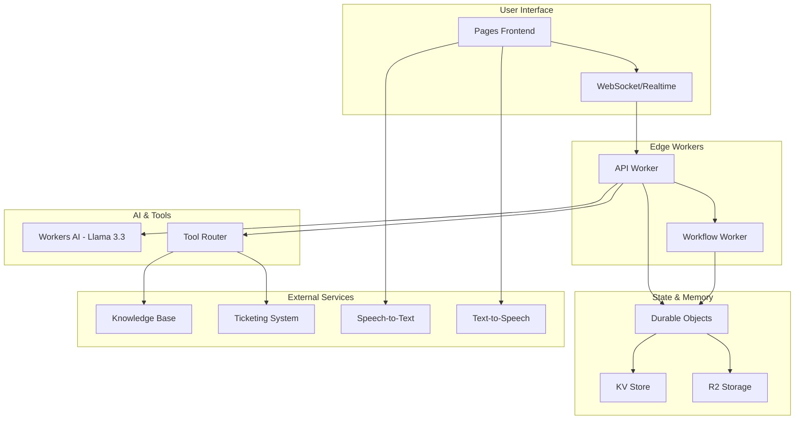

# Design Document

## Overview

The Cloudflare AI Support Bot is a distributed system that leverages Cloudflare's edge computing platform to deliver low-latency, scalable AI-powered customer support. The architecture combines Workers AI for LLM inference, Durable Objects for session state management, Workflows for reliable orchestration, and Pages with Realtime for the user interface.

The system is designed around three core principles:
1. **Edge-first architecture** - Minimize latency by processing at the edge
2. **Reliable state management** - Use Durable Objects for consistent session handling
3. **Fault-tolerant orchestration** - Leverage Workflows for complex, long-running operations

## Architecture



## Components and Interfaces

### 1. Frontend Layer (Pages + Realtime)

**Purpose**: Provides the user interface and real-time communication

**Key Files**:
- `pages/index.html` - Main chat interface
- `pages/app.tsx` - React-based chat component
- `pages/voice.ts` - Voice input/output handling

**Interfaces**:
```typescript
interface ChatMessage {
  id: string;
  sessionId: string;
  content: string;
  role: 'user' | 'assistant';
  timestamp: number;
  metadata?: {
    toolCalls?: ToolCall[];
    voiceEnabled?: boolean;
  };
}

interface SessionState {
  id: string;
  userId?: string;
  status: 'active' | 'idle' | 'ended';
  createdAt: number;
  lastActivity: number;
}
```

### 2. API Worker Layer

**Purpose**: Handles HTTP requests, WebSocket connections, and coordinates between components

**Key Files**:
- `workers/api.ts` - Main API handler with bindings
- `workers/websocket.ts` - WebSocket connection management

**Interfaces**:
```typescript
interface WorkerBindings {
  AI: Ai;
  MEMORY_DO: DurableObjectNamespace;
  CHAT_KV: KVNamespace;
  ARCHIVE_R2: R2Bucket;
  WORKFLOWS: WorkflowNamespace;
}

interface APIRequest {
  sessionId: string;
  message: string;
  context?: ConversationContext;
  tools?: string[];
}
```

### 3. Durable Objects (Memory Management)

**Purpose**: Manages session state, conversation memory, and real-time coordination

**Key Files**:
- `workers/do_memory.ts` - Durable Object class implementation

**Interfaces**:
```typescript
interface ConversationMemory {
  sessionId: string;
  messages: ChatMessage[];
  summary: string;
  context: Record<string, any>;
  lastSummaryAt: number;
  ttl: number;
}

interface MemoryOperations {
  addMessage(message: ChatMessage): Promise<void>;
  getContext(): Promise<ConversationContext>;
  generateSummary(): Promise<string>;
  cleanup(): Promise<void>;
}
```

### 4. Workflow Orchestration

**Purpose**: Handles complex, multi-step operations with reliability guarantees

**Key Files**:
- `workers/workflow.ts` - Workflow definitions and step handlers

**Interfaces**:
```typescript
interface WorkflowStep {
  id: string;
  name: string;
  input: any;
  output?: any;
  retryCount: number;
  status: 'pending' | 'running' | 'completed' | 'failed';
}

interface SupportWorkflow {
  processComplexQuery(query: string, context: ConversationContext): Promise<WorkflowResult>;
  executeToolChain(tools: ToolCall[]): Promise<ToolResult[]>;
  handleEscalation(ticketData: TicketData): Promise<EscalationResult>;
}
```

### 5. Tool Integration System

**Purpose**: Provides extensible tool calling capabilities for the AI

**Interfaces**:
```typescript
interface Tool {
  name: string;
  description: string;
  parameters: Record<string, any>;
  execute(params: any, context: ToolContext): Promise<ToolResult>;
}

interface ToolResult {
  success: boolean;
  data?: any;
  error?: string;
  metadata?: Record<string, any>;
}

// Built-in tools
interface KnowledgeBaseTool extends Tool {
  search(query: string, filters?: SearchFilters): Promise<SearchResult[]>;
}

interface TicketingTool extends Tool {
  createTicket(issue: IssueData): Promise<TicketResult>;
  fetchStatus(ticketId: string): Promise<TicketStatus>;
  updateTicket(ticketId: string, update: TicketUpdate): Promise<TicketResult>;
}
```

## Data Models

### Session Management
```typescript
interface Session {
  id: string;
  userId?: string;
  createdAt: number;
  lastActivity: number;
  status: SessionStatus;
  metadata: SessionMetadata;
}

interface SessionMetadata {
  userAgent?: string;
  ipAddress?: string;
  referrer?: string;
  voiceEnabled: boolean;
  language: string;
}
```

### Message Processing
```typescript
interface ProcessedMessage {
  original: ChatMessage;
  processed: {
    intent?: string;
    entities?: Entity[];
    sentiment?: number;
    toolCalls?: ToolCall[];
  };
  aiResponse: {
    content: string;
    reasoning?: string;
    confidence: number;
  };
}
```

### Memory and Context
```typescript
interface ConversationContext {
  sessionId: string;
  summary: string;
  recentMessages: ChatMessage[];
  userProfile?: UserProfile;
  activeTopics: string[];
  resolvedIssues: string[];
}
```

## Error Handling

### 1. Graceful Degradation Strategy
- **AI Model Fallback**: Primary Llama 3.3 → OpenAI API fallback
- **Voice Feature Fallback**: Voice input failure → text-only mode
- **Tool Failure Handling**: Tool unavailable → inform user and suggest alternatives

### 2. Retry Mechanisms
```typescript
interface RetryConfig {
  maxAttempts: number;
  backoffStrategy: 'exponential' | 'linear' | 'fixed';
  baseDelay: number;
  maxDelay: number;
  retryableErrors: string[];
}

// Workflow-level retries with idempotency
interface WorkflowRetry extends RetryConfig {
  idempotencyKey: string;
  compensationSteps?: WorkflowStep[];
}
```

### 3. Circuit Breaker Pattern
```typescript
interface CircuitBreaker {
  state: 'closed' | 'open' | 'half-open';
  failureThreshold: number;
  recoveryTimeout: number;
  lastFailureTime: number;
  consecutiveFailures: number;
}
```

### 4. Error Response Structure
```typescript
interface ErrorResponse {
  error: {
    code: string;
    message: string;
    details?: any;
    retryable: boolean;
    fallbackAvailable: boolean;
  };
  requestId: string;
  timestamp: number;
}
```

## Testing Strategy

### 1. Unit Testing
- **Durable Object Testing**: Mock DO environment for state management tests
- **Tool Testing**: Mock external APIs for tool integration tests
- **Workflow Testing**: Test individual steps and compensation logic
- **Message Processing**: Test AI response parsing and context management

### 2. Integration Testing
- **End-to-End Flows**: Complete conversation flows with tool usage
- **WebSocket Testing**: Real-time message exchange and reconnection
- **Workflow Integration**: Multi-step process execution and failure recovery
- **Memory Persistence**: Session state across DO hibernation/activation

### 3. Load Testing
```typescript
interface LoadTestConfig {
  concurrentSessions: number;
  messagesPerSession: number;
  duration: number;
  rampUpTime: number;
  scenarios: TestScenario[];
}

interface TestScenario {
  name: string;
  weight: number; // percentage of traffic
  actions: TestAction[];
}
```

### 4. Performance Testing
- **Latency Benchmarks**: P50, P95, P99 response times
- **Memory Usage**: DO memory consumption patterns
- **Tool Response Times**: External API call performance
- **WebSocket Throughput**: Concurrent connection handling

### 5. Chaos Testing
- **Network Partitions**: Test DO consistency during network issues
- **Service Failures**: AI model unavailability scenarios
- **Resource Exhaustion**: High memory/CPU usage conditions
- **Workflow Interruptions**: Mid-execution failure recovery

## Security and Compliance

### 1. Data Protection
- **PII Detection**: Regex and ML-based sensitive data identification
- **Data Encryption**: At-rest encryption in R2, in-transit via TLS
- **Data Retention**: Configurable TTL for conversation archives
- **Access Controls**: Session-based access to conversation data

### 2. Rate Limiting and Abuse Prevention
```typescript
interface RateLimitConfig {
  requestsPerMinute: number;
  tokensPerHour: number;
  concurrentSessions: number;
  burstAllowance: number;
}
```

### 3. Content Filtering
- **Input Sanitization**: XSS and injection prevention
- **Output Filtering**: Inappropriate content detection
- **Prompt Injection Protection**: Malicious prompt detection and blocking

## Observability and Monitoring

### 1. Metrics Collection
```typescript
interface SystemMetrics {
  requestLatency: HistogramMetric;
  errorRate: CounterMetric;
  activeConnections: GaugeMetric;
  aiTokenUsage: CounterMetric;
  toolExecutionTime: HistogramMetric;
}
```

### 2. Logging Strategy
- **Structured Logging**: JSON format with consistent fields
- **Request Tracing**: Unique request IDs across all components
- **Performance Logging**: Latency and resource usage tracking
- **Error Logging**: Detailed error context and stack traces

### 3. Alerting
- **Error Rate Thresholds**: Alert on elevated error rates
- **Latency Degradation**: Alert on P95 latency increases
- **Resource Exhaustion**: Alert on high memory/CPU usage
- **External Service Failures**: Alert on tool/API failures

This design provides a robust, scalable foundation for the Cloudflare AI Support Bot that leverages the unique advantages of Cloudflare's edge computing platform while ensuring reliability, performance, and maintainability.